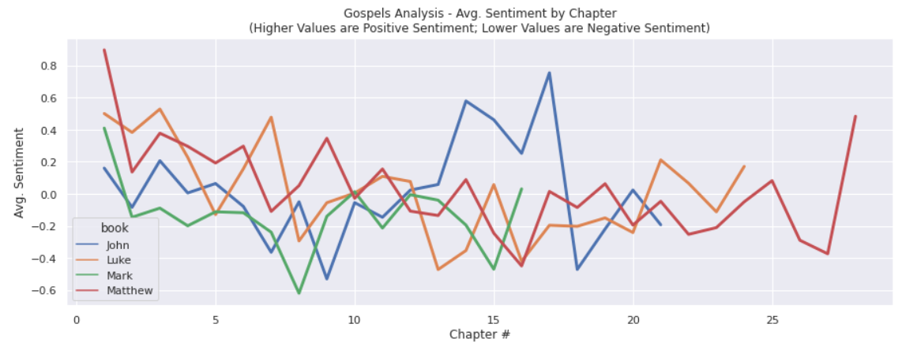

# bible-nlp-analysis
Analzying the Bible with NLP

## Overview and Purpose

This project started as an initial exploration of Hugging Face transformers - specifically NLP models

## Text Context
For this analysis, I used the [Berean Translation](https://berean.bible/)
This translation as open licensing and is easily downloadable using the Requests library

## How to get started

1. clone repository with:
```
git clone https://github.com/van-william/bible-nlp-analysis.git
```
2. Install dependencies with:
```
pip install -r requirements.txt
```
3. Run the jupyter notebooks (gospel-nlp-analysis.ipynb is primary):

## Notebook Usage
- Jupyter Notebooks were used for initial exploration and investigation
- Future attempts will seek to leverage streamlined pipelines for more repeatable results (e.g. Kedro)

## Example Output
See below for an example image output for the Gospels (Matthew, Mark, Luke, and John)

